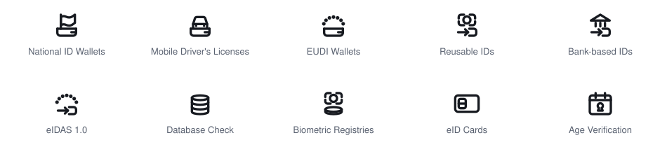
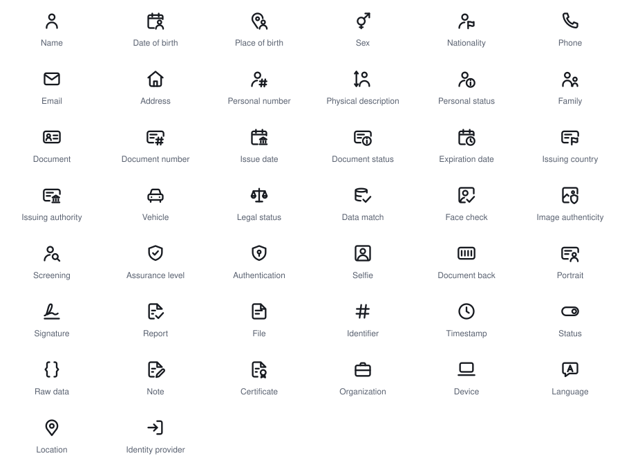

# Digital ID Icons

An open visual vocabulary for recurring concepts related to digital IDs, designed by [Riley Hughes](https://x.com/rileyphughes) at [Trinsic](https://www.trinsic.id).

The set uses shared visual components to show relationships between categories, concepts, and functionality. It has two parts: ten icons for categories of digital ID, built from five reusable components, and 44 icons for the attributes a verification returns, built from 11 badges. Contributions welcome.

## The icons

<picture>
  <source media="(prefers-color-scheme: dark)" srcset="./docs/preview-categories-dark.svg">
  
</picture>

| | | |
| --- | --- | --- |
| **[National ID Wallets](https://www.trinsic.id/category/national-id-wallets)**<br><code>national-id-wallets</code> | **[Mobile Driver's Licenses](https://www.trinsic.id/category/mobile-driver-s-licenses)**<br><code>mobile-drivers-licenses</code> | **[EUDI Wallets](https://www.trinsic.id/category/eudi-wallets)**<br><code>eudi-wallets</code> |
| **[Reusable IDs](https://www.trinsic.id/category/reusable-ids)**<br><code>reusable-ids</code> | **[Bank-based IDs](https://www.trinsic.id/category/bank-based-ids)**<br><code>bank-based-ids</code> | **[eIDAS 1.0](https://www.trinsic.id/category/eidas-1-0)**<br><code>eidas-1-0</code> |
| **[Database Check](https://www.trinsic.id/category/database-checks)**<br><code>database-check</code> | **[Biometric Registries](https://www.trinsic.id/category/biometric-registries)**<br><code>biometric-registries</code> | **[eID Cards](https://www.trinsic.id/category/eid-cards)**<br><code>eid-cards</code> |
| **Age Verification**<br><code>age-verification</code> | | |

For more information about digital IDs in these categories, see [Trinsic's coverage](https://www.trinsic.id/coverage).

## The language

Most icons combine a top mark—what kind of ID it is—with a bottom component—how the ID is held or accessed.

| Component | Meaning | Used by |
| --- | --- | --- |
| Wallet | A credential held and presented from a wallet | National ID Wallets, Mobile Driver's Licenses, EUDI Wallets |
| Sign-in | A redirect or sign-in to an existing identity provider | Reusable IDs, Bank-based IDs, eIDAS 1.0 |
| Registry | A lookup against an authoritative source | Database Check, Biometric Registries |
| Biometric | An abstract biometrics-related cue | Reusable IDs, Biometric Registries |
| EU dots | An abstract EU-related cue | EUDI Wallets, eIDAS 1.0 |

Two icons stand alone. eID Cards is the one physical card in the set. Age Verification is a calendar with a keyhole: the date of birth is checked, but it stays locked.

The shared parts are available in [`components/`](./components/) for people extending the system. Read the [design system](./docs/design-system.md) before modifying them.

## Attribute icons

Icons for the fields a verification returns: names, dates, places, documents, checks, and attachments. They use the same grid and stroke, and are drawn to stay readable at **16 px**, the size they usually appear at in a list of fields.

<picture>
  <source media="(prefers-color-scheme: dark)" srcset="./docs/preview-attributes-dark.svg">
  
</picture>

| | | | |
| --- | --- | --- | --- |
| Name<br><code>name</code> | Date of birth<br><code>date-of-birth</code> | Place of birth<br><code>place-of-birth</code> | Sex<br><code>sex</code> |
| Nationality<br><code>nationality</code> | Phone<br><code>phone</code> | Email<br><code>email</code> | Address<br><code>address</code> |
| Personal number<br><code>personal-number</code> | Physical description<br><code>physical-description</code> | Personal status<br><code>personal-status</code> | Family<br><code>family</code> |
| Document<br><code>document</code> | Document number<br><code>document-number</code> | Issue date<br><code>issue-date</code> | Document status<br><code>document-status</code> |
| Expiration date<br><code>expiration-date</code> | Issuing country<br><code>issuing-country</code> | Issuing authority<br><code>issuing-authority</code> | Vehicle<br><code>vehicle</code> |
| Legal status<br><code>legal-status</code> | Data match<br><code>match</code> | Face check<br><code>face-check</code> | Image authenticity<br><code>image-authenticity</code> |
| Screening<br><code>screening</code> | Assurance level<br><code>assurance</code> | Authentication<br><code>authentication</code> | Selfie<br><code>selfie</code> |
| Document back<br><code>document-back</code> | Portrait<br><code>portrait</code> | Signature<br><code>signature</code> | Report<br><code>report</code> |
| File<br><code>file</code> | Identifier<br><code>identifier</code> | Timestamp<br><code>timestamp</code> | Status<br><code>status</code> |
| Raw data<br><code>raw-data</code> | Note<br><code>note</code> | Certificate<br><code>certificate</code> | Organization<br><code>organization</code> |
| Device<br><code>device</code> | Language<br><code>language</code> | Location<br><code>location</code> | Identity provider<br><code>provider</code> |

Most attribute icons pair a base, which says what kind of value it is (a person, a date, a place, a document, a page, a picture), with a badge in the bottom-right corner, which says which one. A badge means the same thing on every base.

| Badge | Meaning | Used by |
| --- | --- | --- |
| Person | of the person | Date of birth, Place of birth, Portrait |
| Issuer | issued by | Issue date, Issuing authority |
| Flag | country of | Issuing country, Nationality |
| Clock | runs out | Expiration date |
| Check | verified | Face check, Data match, Report |
| Number | its number | Document number, Personal number |
| Info | status | Document status, Personal status |
| Magnifier | searched | Screening |
| Shield | authentic | Image authenticity |
| Seal | certified | Certificate |
| Pencil | written | Note |

The badges are in [`attributes/badges/`](./attributes/badges/). The bare base is its own icon where the base alone means something: Name is the bare person, File the bare page.

## Use

Download an SVG from [`icons/`](./icons/) or [`attributes/`](./attributes/), or every icon at once from the [latest release](https://github.com/trinsic-id/digital-id-icons/releases/latest), and use it as an image:

```html

```

The source SVGs use `currentColor`. To control their color with CSS, inline the SVG markup:

```html
<svg
  viewBox="0 0 24 24"
  width="24"
  height="24"
  role="img"
  aria-labelledby="national-id-wallets-title"
  style="color: #0f6fec"
>
  <title id="national-id-wallets-title">National ID Wallets</title>
  <!-- Copy the paths from icons/national-id-wallets.svg here. -->
</svg>
```

An external SVG loaded through `` does not inherit the page's `color`; it renders with its own default color.

For accessibility, let the page supply the name. If nearby text already says what the icon means, hide it: `alt=""` on an image, `aria-hidden="true"` on inline SVG. If the icon carries meaning on its own, describe that meaning ("Checked against a government registry"), not the file name. Don't rely on color alone to tell icons apart.

The minimum recommended display size is **24 px** for category icons, whose two-part compositions lose separation below that, and **16 px** for attribute icons.

## How it was made

Designed by [Riley Hughes](https://x.com/rileyphughes), who art-directed and approved every icon. Concepts were explored, drafted, and blind-tested with AI models, and each SVG is custom geometry on the 24×24 grid. No path data was copied from another icon set; the grid and stroke follow the same conventions as Lucide and similar outline sets, so the icons sit comfortably beside them. [Testing and limitations](./docs/testing.md) records what was tested and what didn't work.

## Attribution

Feel free to use the icons. We'd appreciate a credit like:

> Digital ID Icons by Trinsic, licensed under CC BY 4.0.

It can live in source, acknowledgements, third-party notices, or documentation; it doesn't need to appear in product UI. If you change the icons, say so, for example: "Adapted from Digital ID Icons by Trinsic, licensed under CC BY 4.0. Changes: heavier stroke." Don't word it in a way that implies Trinsic reviewed or endorses your version.

## License

| Material | License |
| --- | --- |
| SVG artwork in `icons/`, `components/`, and `attributes/`; project documentation | [CC BY 4.0](./LICENSES/CC-BY-4.0.txt) |
| Scripts, examples, build configuration, and other code | [MIT](./LICENSES/MIT.txt) |

Trinsic's names, logos, and marks are not licensed, and the icons are not official marks of the EU, any government, or any identity provider. See [`LICENSE.md`](./LICENSE.md).

## Contributing

Coherence matters more than icon count. Open an issue first, then read [`CONTRIBUTING.md`](./CONTRIBUTING.md). Run the dependency-free validator before proposing a change:

```sh
npm run check
```

## More

- [Design system](./docs/design-system.md): the grammar, the components and badges, and why they look the way they do
- [Testing and limitations](./docs/testing.md)
- [Browser gallery](./examples/gallery.html)
